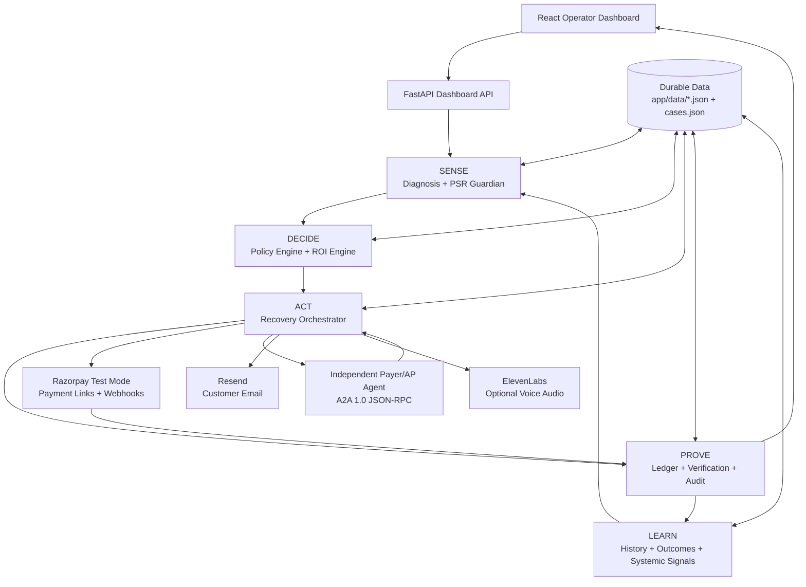
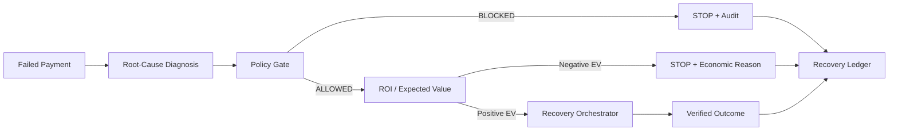
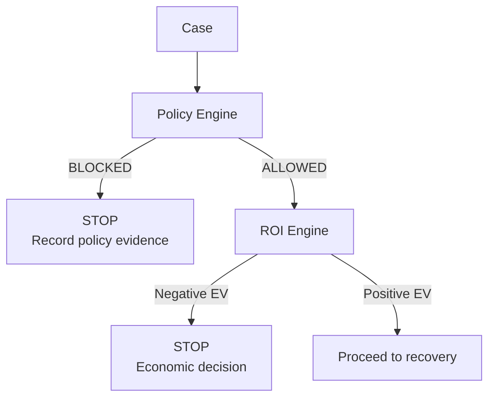
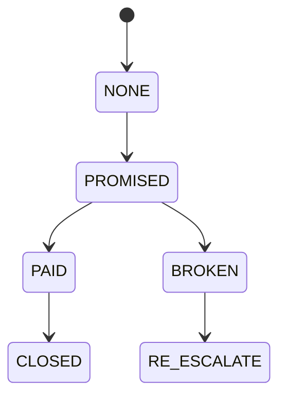
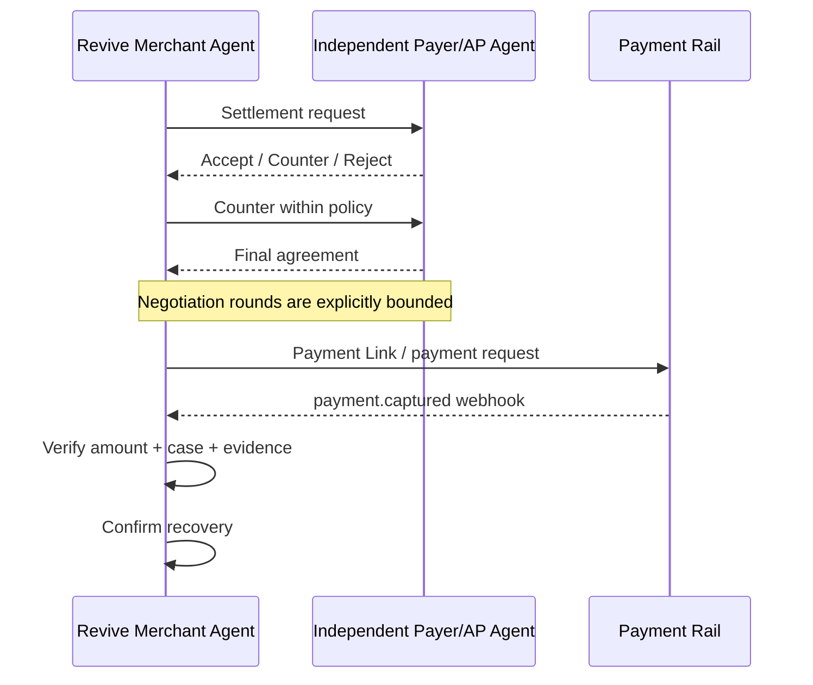
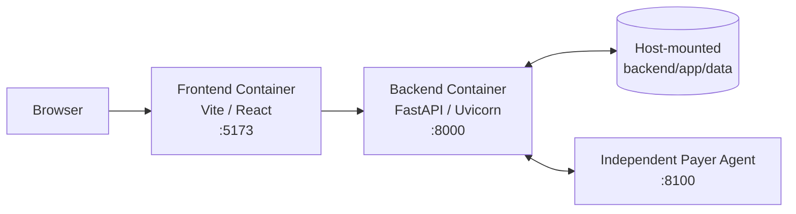

# Revive — AI Revenue Recovery System

> **Razorpay AI Buildathon · Track 03 — AI Revenue Recovery**

[](backend/)
[](frontend/)
[](https://razorpay.com/docs/payments/payment-links/)
[](#status)

**Revive** is an AI-assisted revenue recovery system designed to answer a more important question than *“How do we retry this failed payment?”*:

> **“Why did the payment fail, is recovery worth pursuing, what is the safest next action, and can we prove the outcome?”**

Revive turns payment failures into an explainable recovery workflow:

**Sense → Decide → Act → Prove → Learn**

It combines deterministic root-cause diagnosis, systemic payment-risk detection, policy enforcement, ROI-gated recovery decisions, multi-channel orchestration, Promise-to-Pay tracking, agent-to-agent settlement, real payment integration, customer email notifications, voice recovery, a durable recovery ledger, and an operator-facing AI Copilot.

---

## Table of Contents

- [Why Revive](#why-revive)
- [Quick Start](#quick-start)
- [Architecture](#architecture)
- [The Revive Modules](#the-revive-modules)
- [SENSE — Diagnosis & PSR Guardian](#sense)
- [DECIDE — Policy & ROI](#decide)
- [ACT — Orchestration & Mandates](#act)
- [Agent-to-Agent Settlement](#agent-to-agent-settlement)
- [PROVE — Ledger & Verification](#prove)
- [Customer Communication](#customer-communication)
- [Operator AI Copilot](#operator-ai-copilot)
- [Authentication & Team Access](#authentication--team-access)
- [Dashboard](#dashboard)
- [Backend API](#backend-api)
- [Data & Persistence](#data--persistence)
- [Docker Architecture](#docker-architecture)
- [Getting Started](#getting-started)
- [Environment Variables](#environment-variables)
- [Run with Docker](#run-with-docker)
- [Run Natively](#run-natively)
- [A2A Payer Agent](#a2a-payer-agent)
- [Razorpay Test Mode](#razorpay-test-mode)
- [Testing](#testing)
- [Synthetic vs. Real Components](#synthetic-vs-real-components)
- [Example Economic Result](#example-economic-result)
- [Reliability & Failure Handling](#reliability--failure-handling)
- [Why the Architecture Matters](#why-the-architecture-matters)
- [Project Structure](#project-structure)
- [Security Notes](#security-notes)
- [Design Principles](#design-principles)
- [Status](#status)

---

## Why Revive

Traditional recovery systems often behave like:

```text
Payment failed
      ↓
Retry
      ↓
Retry again
      ↓
Escalate
      ↓
Give up
```

Revive instead treats recovery as an **economic, policy-aware decision system**:

```text
Payment failure
      ↓
Understand the cause
      ↓
Check systemic payment risk
      ↓
Apply policy & compliance gates
      ↓
Calculate expected recovery value
      ↓
Choose the safest worthwhile action
      ↓
Execute recovery
      ↓
Verify the real outcome
      ↓
Record evidence
      ↓
Learn which patterns matter next
```

The key principle is:

> **Recovery is not successful because an action was attempted. Recovery is successful only when the outcome is verified.**

---

## Quick Start

For judges/reviewers who just want it running:

```bash
git clone <this-repo-url>
cd revive
cp .env.example .env        # fill in real keys only for the integrations you want live
docker compose up --build
```

```text
Frontend  → http://localhost:5173
Backend   → http://localhost:8000
Health    → http://localhost:8000/api/health
```

### First-time login

This repo ships with a **pre-seeded demo team** in `backend/app/data/users.json`
(`admin@revive.ai`, `operator@revive.ai`, `tester@revive.ai`) so reviewers see
Team management populated immediately. Their passwords aren't published in
this repo — if you have them, just log in and skip to Team management below.

Standing up your **own instance** without those credentials? You need to
bootstrap your own admin instead of the seeded one:

1. Before first run, empty the seed file on the host (it's bind-mounted, so
   editing it only inside a running container won't stick):
   ```bash
   echo "[]" > backend/app/data/users.json
   ```
2. Start the stack: `docker compose up --build`
3. Call the bootstrap endpoint **once** — it only works while `users.json`
   is empty, and closes permanently after the first account is created:
   ```bash
   curl -X POST http://localhost:8000/api/auth/register \
     -H "Content-Type: application/json" \
     -d '{"name": "Your Name", "email": "you@example.com", "password": "a-strong-password"}'
   ```
   This account is automatically made `ADMIN`.
4. Log in at http://localhost:5173 with that email/password.
5. Add everyone else from **inside the app** (see Team management below) —
   `/api/auth/register` is now disabled for good.

Every external integration (Razorpay, Resend, ElevenLabs, Groq/OpenAI, the A2A payer agent) is **optional** — the system runs fully offline on its seeded synthetic dataset with no keys configured at all. See [Environment Variables](#environment-variables) for what each key unlocks.

---

# Architecture

## 1. System Architecture



---

## 2. Core Decision Flow

Revive separates **detection**, **decision**, **execution**, and **proof** so that an action can never be mistaken for a successful recovery.



The Policy Engine is authoritative. The ROI engine **cannot override a policy block**.

---

# The Revive Modules

| Layer | Module | Responsibility |
|---|---|---|
| 0 | Data & Grounding | Deterministic synthetic cases, customer data and persistent runtime state |
| 1 | Root-Cause Diagnosis | Determines why a payment failed |
| 2 | PSR Guardian | Detects systemic payment-route anomalies across failures |
| 3 | Policy & Compliance | Applies contact, discount, promise, dispute and opt-out rules |
| 4 | Recovery Orchestrator | Selects and sequences recovery actions |
| 5 | Promise-to-Pay | Tracks promised payments as a durable state machine |
| 6 | A2A Settlement | Negotiates B2B settlements with an independent payer/AP agent |
| 7 | ROI Portfolio Engine | Calculates expected value and stopping rules |
| 8 | Recovery Ledger | Records decisions, actions, outcomes and evidence |
| 9 | Mandate Retry Sequencer | Handles UPI Autopay/eNACH-specific retry cadence |
| 10 | Customer Alerts | Sends real Promise-to-Pay lifecycle emails |
| 11 | Voice Recovery | Generates grounded Hinglish recovery scripts and optional audio |
| 12 | Operator Copilot | Provides tool-based operator assistance with confirmation-gated writes |
| 13 | Dashboard API + React UI | Presents the complete recovery operation to human operators |

---

# SENSE

## Root-Cause Diagnosis

Located in:

```text
backend/app/diagnosis/
```

The diagnosis layer classifies payment failures into operational root causes such as:

- `insufficient_funds`
- `otp_timeout`
- `issuer_declined`
- `card_expired`
- `mandate_expired_or_revoked`
- `mandate_debit_failed`
- `network_error`
- `invoice_dispute`
- `b2b_cashflow_delay`
- `payment_approval_delay`
- `administrative_delay`
- `checkout_abandonment`

The module can use a configured LLM fallback, but the system remains functional without an LLM by using a transparent heuristic fallback.

The important architectural boundary is:

> Diagnosis explains the failure; it does **not** decide whether the business should pursue recovery.

---

## PSR Guardian — Systemic Risk Detection

Located in:

```text
backend/app/psr_guardian/guardian.py
```

PSR Guardian looks across the **payment stream**, rather than treating every failure independently.

It analyzes observable operational fields including:

```text
bank
card_network
decline_code
timestamp
```

and searches for concentrated failure clusters.

Example:

```text
Many individual failures
          ↓
Group by payment route
          ↓
Analyze time concentration
          ↓
Detect abnormal cluster
          ↓
Route Alert
          ↓
Recommend intervention
```

This lets Revive distinguish:

> **“Customers are failing”**

from:

> **“A payment route is degrading and causing customers to fail.”**

That closes the loop between recovering lost revenue and preventing the next lost payment.

---

# DECIDE

## Policy & Compliance Engine

Located in:

```text
backend/app/core/policy.py
backend/app/core/policy.yaml
```

Business rules are configuration-driven.

The current policy configuration includes:

- Maximum contact attempts
- Contact cooldown
- Contact window in `Asia/Kolkata`
- Maximum settlement discount
- Maximum A2A negotiation rounds
- Promise-to-Pay hard stop
- Disputed-invoice hard stop
- Customer opt-out hard stop
- Channel costs
- Channel recovery priors
- Generic retry limits
- Mandate retry limits
- High-value escalation threshold
- Audit requirements
- ROI attempt decay
- Root-cause recovery multipliers

### Policy precedence



**Policy always wins.**

---

## ROI Portfolio Engine

Located in:

```text
backend/app/roi_engine/roi.py
```

The ROI engine evaluates recovery as an economic portfolio rather than blindly maximizing the number of attempts.

Core expected-value model:

```text
Expected Recovery = P(success) × recoverable amount

Expected Value = Expected Recovery − action cost
```

The probability is adjusted using:

- channel prior
- root cause
- attempt number / decay

A case can therefore be intentionally stopped when:

```text
Expected Value < 0
```

That is recorded as a **decision**, not hidden as a failure.

This creates an important distinction:

```text
NOT RECOVERED
      ≠
BAD DECISION
```

Sometimes the correct recovery action is to **stop spending money on a low-value chase**.

---

# ACT

## Recovery Orchestrator

Located in:

```text
backend/app/orchestrator/orchestrator.py
```

The orchestrator converts an allowed decision into a recovery action sequence.

It works with the diagnosis, policy result and economic decision instead of independently inventing business logic.

The available recovery surfaces include configured channels such as:

- Payment retry
- Email
- WhatsApp
- Voice
- Human escalation
- B2B settlement negotiation

The actual action remains bounded by policy and ROI.

---

## Mandate Retry Sequencer

Located in:

```text
backend/app/mandate_sequencer/sequencer.py
```

UPI Autopay/eNACH debit failures are handled separately from generic card retries.

The configured mandate flow includes:

```text
Pre-debit notice
      ↓
Attempt
      ↓
Wait required gap
      ↓
Pre-debit notice
      ↓
Attempt
      ↓
Attempt cap reached?
      ↓
Mandate re-authorization escalation
```

This prevents recurring-payment failures from being treated like ordinary card retries.

---

## Promise-to-Pay

Located in:

```text
backend/app/promise_tracker/tracker.py
```

Promise-to-Pay is implemented as a durable state machine:



A promise activates the Policy Engine's Promise-to-Pay hard stop.

The tracker persists:

- `promise_id`
- case/customer/invoice information
- promised amount
- promise date
- status
- payment reference
- verification evidence
- history
- transitions

Promise lifecycle data survives backend restarts when the persistent Docker data mount is used.

---

# Agent-to-Agent Settlement

Located in:

```text
backend/app/a2a_settlement/
```

Revive supports bounded B2B settlement negotiation with an **independent payer/AP agent**.



The A2A layer follows the project's A2A 1.0 implementation.

The independent payer agent publishes an Agent Card at:

```text
/.well-known/agent-card.json
```

and exposes JSON-RPC through its advertised interface.

### Important state distinction

```text
AGREED
  ≠
PAYMENT_CONFIRMED
```

An agreement means the agents reached settlement terms.

A recovery is only confirmed after the payment rail provides authoritative payment evidence.

---

# PROVE

## Recovery Ledger

Located in:

```text
backend/app/recovery_ledger/ledger.py
```

The ledger provides an auditable record of recovery activity.

It preserves evidence for:

- Policy decisions
- ROI decisions
- Recovery attempts
- Actions
- Outcomes
- Recovered amounts
- Stopped cases
- Reasons for stopping

This allows the dashboard to answer:

> **What happened, why did Revive do it, and what was the result?**

---

## Real Payment Verification

Located in:

```text
backend/app/payments/razorpay_gateway.py
```

Revive integrates with **Razorpay Test Mode** for payment links and webhook verification.

The webhook path uses the captured payment event as the authoritative confirmation signal.

The system verifies:

```text
Payment
  ↓
revive_case_tag
  ↓
Case mapping
  ↓
Expected negotiated / promised amount
  ↓
Webhook signature
  ↓
Confirmed recovery
```

A payment event is not accepted merely because a link was created or a settlement was agreed.

---

# Customer Communication

## Email Alerts

Located in:

```text
backend/app/customer_alerts/alerts.py
```

Customer Promise-to-Pay lifecycle notifications are delivered through the **Resend REST API**.

Supported events:

```text
PROMISE_CREATED
DUE_SOON
PAYMENT_VERIFIED
PROMISE_BROKEN
```

Delivery is durable and idempotent.

An event is recorded as `sent` only after the provider accepts the email.

---

## Voice Recovery

Located in:

```text
backend/app/voice_recovery/hinglish_voice.py
```

Revive can generate grounded Hinglish recovery scripts from an already-diagnosed case.

The voice module:

- Uses the existing diagnosis
- Incorporates Promise-to-Pay context when available
- Does not make recovery decisions
- Stores generated scripts for auditability
- Can generate real audio through ElevenLabs when configured

Voice generation is therefore an **execution surface**, not a decision engine.

---

# Operator AI Copilot

Located in:

```text
backend/app/copilot/agent.py
```

The Copilot gives operators a natural-language interface to Revive's operational data and actions.

### Read tools execute immediately

Examples:

```text
list_cases
get_case
explain_case
get_dashboard_summary
get_psr_alerts
get_ledger
list_customers
get_customer
list_promises
get_promise
```

### Write tools require confirmation

Examples:

```text
create_promise
create_payment_link
mark_promise_paid
send_promise_alert
retry_live_payment
settle_a2a
```

The interaction model is:

```text
Operator request
      ↓
Copilot understands request
      ↓
Read? ───────────────→ Execute
      │
      └── Write
            ↓
       Pending Action
            ↓
       Human confirms
            ↓
          Execute
            ↓
        Audit result
```

This prevents an AI assistant from silently executing consequential recovery operations.

---

# Authentication & Team Access

Located in:

```text
backend/app/auth/
frontend/src/AuthContext.jsx
frontend/src/AuthGate.jsx
frontend/src/UserMenu.jsx
```

Revive uses JWT-based private team authentication.

The backend supports:

- Bootstrap registration
- Email/password login
- JWT sessions
- Current-user lookup
- Team roster
- Admin-created team members
- Role changes
- Member deletion

Supported roles:

```text
ADMIN
OPERATOR
VIEWER
```

Passwords are hashed with PBKDF2-HMAC-SHA256 using the standard library.

### How the first admin is created

There's no separate setup script — the first row ever written to
`users.json` is automatically promoted to `ADMIN` through the public
`POST /api/auth/register` route. That route disables itself permanently
(`403 Forbidden`) the instant any account exists (`has_users()` in
`backend/app/auth/store.py`).

**Note:** this repo is checked in with a non-empty, pre-seeded
`backend/app/data/users.json` (see [Quick Start](#quick-start)), so
`/api/auth/register` is closed by default on a fresh clone unless you
empty that file first.

### How every admin after that is added

Once an admin exists, all further teammates are added **inside the app**,
never through `/api/auth/register`:

1. Sign in as an admin.
2. Open the user menu (top right) → **Team management**.
3. Fill in name, work email, password, and role (`admin` / `operator` /
   `viewer`) — this calls `POST /api/auth/users`.
4. Roles can be changed (`PATCH /api/auth/users/{id}/role`) or members
   removed (`DELETE /api/auth/users/{id}`) from the same panel. Revive
   always keeps at least one admin — the last one can't be demoted or
   deleted.

The application is intended as a **private team workspace**, not a public self-registration product.

---

# Dashboard

The frontend is a React + Vite operator console.

```text
frontend/
└── src/
    ├── App.jsx
    ├── App.css
    ├── AuthContext.jsx
    ├── AuthGate.jsx
    ├── LoginPage.jsx
    ├── UserMenu.jsx
    ├── Dropdown.jsx
    ├── CopilotWidget.jsx
    └── VoiceScriptPanel.jsx
```

The dashboard exposes operational views for:

- Recovery overview
- Recovery cases
- Customers
- Promises-to-Pay
- Live payment cases
- A2A settlements
- PSR alerts
- Recovery ledger
- Notifications
- ROI/stopping-rule evidence
- Voice recovery
- Operator Copilot
- Team management

The interface is designed around the same operational lifecycle as the backend:

```text
Sense → Decide → Act → Prove
```

---

# Backend API

The FastAPI service is located at:

```text
backend/app/dashboard_api/api.py
```

### Core

```text
GET  /api/health
POST /api/run-batch
GET  /api/batch-history
GET  /api/dashboard
GET  /api/metrics
GET  /api/board-report
```

### Cases & diagnosis

```text
GET  /api/cases
GET  /api/cases/{case_id}
POST /api/cases/{case_id}/explain
```

### Customers

```text
GET /api/customers
GET /api/customers/{customer_id}
```

### PSR & ledger

```text
GET /api/psr-alerts
GET /api/ledger
GET /api/ledger/{case_id}
```

### Promises

```text
GET  /api/promises
GET  /api/promises/{case_id}
GET  /api/promises/{case_id}/history
POST /api/promises
POST /api/promises/{case_id}/payment-link
POST /api/promises/{case_id}/mark-paid
GET  /api/promises-metrics
```

### Customer alerts

```text
GET  /api/customer-alerts
POST /api/promises/{case_id}/send-alert
```

### Payments

```text
POST   /api/payments/checkout
POST   /api/payments/webhook
GET    /api/payments/live-cases
POST   /api/payments/live-cases/{case_id}/retry
DELETE /api/payments/live-cases
```

### A2A

```text
POST /api/a2a/live/{case_id}/settle
GET  /api/a2a/live-settlements
GET  /api/a2a
```

### Voice

```text
POST /api/cases/{case_id}/voice-script
GET  /api/cases/{case_id}/voice-scripts
GET  /api/voice-scripts
GET  /api/voice-audio/{script_id}
```

### Copilot

```text
POST /api/copilot/chat
POST /api/copilot/confirm
GET  /api/copilot/audit-log
```

### Authentication

```text
POST   /api/auth/register
POST   /api/auth/login
GET    /api/auth/me
GET    /api/auth/users
POST   /api/auth/users
PATCH  /api/auth/users/{id}/role
DELETE /api/auth/users/{id}
```

---

# Data & Persistence

Application state is stored under:

```text
backend/app/data/
```

The project currently contains file-backed stores including:

```text
cases.json
cases.csv
customers.json
users.json
promise_tracker.json
customer_alerts.json
live_cases.json
live_a2a_settlements.json
batch_history.json
real_captured_case.json
```

Docker persists the complete directory:

```yaml
volumes:
  - ./backend/app/data:/app/app/data
```

Therefore rebuilds/recreates of the backend container do **not** intentionally discard application state.

This is especially important for:

- Team accounts
- Customers
- Promise history
- Customer alert history
- Live recovery cases
- A2A settlement state
- Batch history

---

# Docker Architecture



The main application runs as two Docker services:

```text
backend
frontend
```

The independent payer/AP agent is a separate service/process used for the A2A demonstration.

---

# Getting Started

## Prerequisites

- Docker Desktop
- Docker Compose
- Git
- A Razorpay Test Mode account/credentials if testing payment flows
- Resend API credentials if testing real customer email
- Optional Anthropic/OpenAI/Groq credentials for configured AI functionality
- Optional ElevenLabs credentials for real voice audio

---

# Environment Variables

Copy the template and fill in only what you need:

```bash
cp .env.example .env
```

`.env.example` lives at the project root and documents every variable the **main backend** reads. **Never commit `.env` or real credentials to GitHub** — the root `.gitignore` already excludes `.env` (and anything matching `.env.*`) so a plain `git add .` is safe.

```text
# Auth
REVIVE_JWT_SECRET=                      # falls back to an insecure dev secret if unset (logs a warning)

# Razorpay Test Mode (payments/checkout, webhook verification)
RAZORPAY_KEY_ID=
RAZORPAY_KEY_SECRET=
RAZORPAY_WEBHOOK_SECRET=

# Ops Copilot / diagnosis LLM fallback (Groq-compatible OpenAI SDK)
GROQ_API_KEY=
REVIVE_EXPLAINER_MODEL=openai/gpt-oss-120b

# A2A Settlement — independent payer/AP agent this app talks TO
A2A_PAYER_AGENT_CARD_URL=http://host.docker.internal:8100/.well-known/agent-card.json
A2A_PAYER_AGENT_BEARER_TOKEN=
A2A_REQUEST_TIMEOUT_SECONDS=10

# Customer email (Promise-to-Pay lifecycle notifications)
RESEND_API_KEY=
RESEND_FROM_EMAIL=

# Optional real voice audio
ELEVENLABS_API_KEY=

# Promise-to-Pay scheduling
PROMISE_TIMEZONE=Asia/Kolkata
PROMISE_CHECK_INTERVAL_SECONDS=60
```

Every one of these is optional in isolation:

- No `GROQ_API_KEY` → the Copilot returns a clear "not configured" message instead of crashing, and diagnosis falls back to its deterministic heuristic.
- No `A2A_PAYER_AGENT_CARD_URL`, or the payer agent is unreachable → the A2A engine falls back to its offline synthetic negotiator (`a2a_mode = "mock"`) instead of crashing the pipeline (see [Reliability & Failure Handling](#reliability--failure-handling)).
- No Razorpay keys → live payment endpoints return a clear config error instead of touching the network; the rest of the dashboard is unaffected.
- No `REVIVE_JWT_SECRET` → auth still works locally with a dev fallback secret (logged loudly — set a real one before anything public-facing).

The **A2A payer agent itself** (the separate demo service Revive negotiates with) reads a different set of variables — see [A2A Payer Agent](#a2a-payer-agent).

---

# Run with Docker

From the project root:

```bash
docker compose up --build
```

Frontend:

```text
http://localhost:5173
```

Backend:

```text
http://localhost:8000
```

Health check:

```text
http://localhost:8000/api/health
```

The backend data directory is mounted from:

```text
./backend/app/data
```

so runtime data persists on the host.

---

# Run Natively

## Backend

```bash
cd backend
pip install -r requirements.txt
```

Run the deterministic pipeline:

```bash
python app/pipeline.py
```

Run the API:

```bash
uvicorn app.dashboard_api.api:app --reload
```

On Windows, use `python` rather than `python3`.

## Frontend

In another terminal:

```bash
cd frontend
npm install
npm run dev
```

The frontend is served by Vite on:

```text
http://localhost:5173
```

---

# A2A Payer Agent

The independent payer/AP agent runs separately from the main backend.

From:

```text
backend/
```

run:

```powershell
$env:A2A_PAYER_AGENT_BEARER_TOKEN="your-demo-token"
$env:PAYER_AGENT_ID="payer-ap-agent-demo-001"
$env:A2A_PUBLIC_URL="http://host.docker.internal:8100"

python -m uvicorn app.a2a_settlement.payer_agent:app --host 0.0.0.0 --port 8100
```

Verify its Agent Card:

```powershell
Invoke-RestMethod `
  -Uri "http://127.0.0.1:8100/.well-known/agent-card.json" `
  -Headers @{ Authorization = "Bearer your-demo-token" }
```

The Dockerized Revive backend can reach the payer agent through:

```text
http://host.docker.internal:8100
```

---

# Razorpay Test Mode

Revive's payment integration is designed for Razorpay **Test Mode**.

The integration supports:

- Payment Link creation
- Recovery case tagging
- Promise-to-Pay payment links
- Payment capture webhook handling
- Webhook signature verification
- Mapping captured payments back to Revive cases
- Recovery confirmation

Use Test Mode credentials:

```text
rzp_test_...
```

Keep Razorpay secrets only in `.env`.

## Webhook integration (Razorpay → Revive)

Razorpay needs to reach your backend over the public internet to deliver
`payment.failed` / `payment.captured` events — `localhost:8000` isn't
reachable from Razorpay's servers, so a tunnel is required for anything
beyond payment-link creation.

### 1. Start the tunnel

With the stack already running (`docker compose up`, backend on
`localhost:8000`):

```bash
docker run --rm cloudflare/cloudflared:latest tunnel --url http://host.docker.internal:8000
```

> On Linux (native Docker Engine, not Docker Desktop), `host.docker.internal`
> isn't resolved automatically — add
> `--add-host=host.docker.internal:host-gateway` to the command above, or
> point `--url` at your host's LAN IP instead.

`cloudflared` prints a random `https://<something>.trycloudflare.com` URL
in its logs — that's your public tunnel URL for this session. This is
Cloudflare's free **Quick Tunnel**: no account or domain needed, but the
URL is temporary and changes every time you restart this command, so
you'll need to redo step 3 whenever the tunnel restarts.

### 2. Verify it's actually reachable

`/api/payments/webhook` also accepts `GET` purely as a reachability check
(it's not what Razorpay calls). From a device that is **not** on your
local network — your phone on mobile data, or https://reqbin.com — hit:

```text
GET https://<your-tunnel-subdomain>.trycloudflare.com/api/payments/webhook
```

You should get back `{"success": true, "reachable": true, ...}`. If you
don't, fix the tunnel before touching any webhook logic — Razorpay can't
reach a server your phone can't reach either.

### 3. Register the webhook in Razorpay

In the Razorpay Dashboard → **Settings → Webhooks**:

- **Webhook URL:** `https://<your-tunnel-subdomain>.trycloudflare.com/api/payments/webhook`
- **Active events:** at minimum `payment.failed` and `payment.captured`
- **Secret:** set this to the exact same value as `RAZORPAY_WEBHOOK_SECRET`
  in your `.env` — a mismatch is the most common cause of rejected webhooks
  (see below)

### 4. Notes

- This route is deliberately excluded from Revive's JWT auth middleware
  (`backend/app/auth/middleware.py`) — Razorpay can't log in, so the route
  authenticates each request itself via the `X-Razorpay-Signature` header
  instead.
- A request is rejected with `400 Invalid or missing webhook signature` if
  the `X-Razorpay-Signature` header is absent, doesn't match, or
  `RAZORPAY_WEBHOOK_SECRET` isn't set in `.env` at all. If that happens,
  re-check that the secret in `.env` is the **webhook** secret from the
  Dashboard, not the API key secret, and that it matches exactly.
- Duplicate webhook deliveries (Razorpay retries) are handled
  idempotently — safe to receive the same event twice.

---

# Testing

The project contains module-level self-tests.

From:

```text
backend/
```

examples include:

```bash
python app/data/generate_data.py
python app/diagnosis/classifier.py
python app/psr_guardian/guardian.py
python app/core/policy.py
python app/promise_tracker/tracker.py
python app/roi_engine/test_roi.py
python app/a2a_settlement/settlement.py
python app/recovery_ledger/ledger.py
python app/pipeline.py
```

The ROI engine also contains a dedicated verification suite:

```text
backend/app/roi_engine/test_roi.py
```

A successful module self-test prints a corresponding:

```text
MODULE N SELF-TEST: PASSED
```

banner.

---

# Synthetic vs. Real Components

Revive deliberately distinguishes deterministic demonstration data from real external integrations.

## Synthetic / deterministic

The repository includes a seeded **105-case synthetic dataset** covering scenarios such as:

- Subscription failures
- Abandoned checkout
- Overdue B2B invoices

The dataset contains a planted payment-route anomaly for PSR Guardian verification.

The pipeline, diagnosis, policy engine, ROI engine, A2A negotiation logic and ledger operate as real application logic over this dataset.

## Real integrations

When configured, Revive can communicate with real external systems:

- **Razorpay Test Mode** — payment links and payment webhooks
- **Resend** — customer email delivery
- **ElevenLabs** — optional real voice generation
- **LLM providers** — optional diagnosis fallback
- **Independent A2A payer agent** — real HTTP/JSON-RPC interaction between separate agent processes

The project does not represent an external payment as recovered merely because an internal action was requested.

---

# Example Economic Result

The repository's documented synthetic benchmark has historically produced approximately:

```text
Addressable revenue at risk     ₹3.53M
Recovered revenue               ₹2.13M
Recovery rate                   ~60%
Deliberately stopped cases      34
```

The exact result should be treated as a **run-generated benchmark**, not a production performance claim. Re-running the generator/pipeline can change the snapshot if the dataset is regenerated.

The important metric is not simply:

```text
How many cases did we touch?
```

It is:

```text
How much economically worthwhile revenue
did we recover while respecting policy?
```

---

# Reliability & Failure Handling

A revenue-recovery system that goes down because one *optional* external integration is unreachable is worse than no system at all — it would turn a payment failure into a dashboard outage. Revive treats degraded-mode operation as a first-class requirement, not an afterthought:

| Dependency | If unreachable / unconfigured | Behavior |
|---|---|---|
| A2A payer agent (`A2A_PAYER_AGENT_CARD_URL`) | Discovery call fails | `A2ASettlementEngine` catches the failure at construction and falls back to the offline synthetic negotiator (`a2a_mode = "mock"`) instead of taking down `RevivePipeline` — and with it, `/api/cases`, `/api/dashboard`, `/api/metrics`, `/api/board-report`, `/api/run-batch` |
| Live A2A settle (`/api/a2a/live/{case_id}/settle`) | Payer agent unreachable | Explicitly refuses with a `502` naming the reason, rather than silently negotiating a *live* settlement against the *mock* agent |
| Groq API (Copilot / diagnosis) | Rate-limited, times out, connection error | `/api/copilot/chat` returns a friendly in-band message (rate-limited / timed out / provider error) instead of a raw `500` traceback |
| Groq API key missing | Not configured | Copilot reports "not configured"; diagnosis silently uses its deterministic heuristic fallback |
| Razorpay keys missing | Not configured | Payment endpoints raise a clear config error; unrelated dashboard endpoints are unaffected |
| `REVIVE_JWT_SECRET` unset | Not configured | Auth still works locally against a dev fallback secret, with a loud warning logged — never rely on this outside a demo |

The guiding rule: **an optional integration being down should degrade one feature, not the dashboard.**

---

# Why the Architecture Matters

## 1. Systemic detection

PSR Guardian operates across cases rather than treating every failure as isolated.

## 2. Safety before economics

The Policy Engine is the authoritative safety boundary.

## 3. Economics before action

The ROI engine prevents unnecessary recovery spend.

## 4. Multi-channel execution

The Orchestrator can use different recovery surfaces based on the case.

## 5. Machine-to-machine recovery

B2B cases can negotiate directly with an independent payer/AP agent.

## 6. Verification over assumption

Payment confirmation comes from authoritative payment evidence rather than an internal “attempt succeeded” flag.

## 7. Human control over consequential AI actions

Copilot write operations require explicit operator confirmation.

## 8. Durable auditability

Decisions, promises, alerts, settlements and recovery outcomes are persisted.

---

# Project Structure

```text
revive/
│
├── backend/
│   ├── app/
│   │   ├── a2a_settlement/
│   │   │   ├── a2a_client.py
│   │   │   ├── live_settlements.py
│   │   │   ├── payer_agent.py
│   │   │   └── settlement.py
│   │   │
│   │   ├── auth/
│   │   ├── copilot/
│   │   ├── core/
│   │   ├── customers/
│   │   ├── customer_alerts/
│   │   ├── dashboard_api/
│   │   ├── data/
│   │   ├── decision_explainer/
│   │   ├── diagnosis/
│   │   ├── mandate_sequencer/
│   │   ├── notifications/
│   │   ├── orchestrator/
│   │   ├── payments/
│   │   ├── promise_tracker/
│   │   ├── psr_guardian/
│   │   ├── recovery_ledger/
│   │   ├── roi_engine/
│   │   ├── voice_recovery/
│   │   └── pipeline.py
│   │
│   ├── Dockerfile
│   └── requirements.txt
│
├── frontend/
│   ├── public/
│   ├── src/
│   │   ├── App.jsx
│   │   ├── App.css
│   │   ├── AuthContext.jsx
│   │   ├── AuthGate.jsx
│   │   ├── CopilotWidget.jsx
│   │   ├── Dropdown.jsx
│   │   ├── LoginPage.jsx
│   │   ├── UserMenu.jsx
│   │   └── VoiceScriptPanel.jsx
│   ├── Dockerfile
│   ├── package.json
│   └── vite.config.js
│
├── docker-compose.yml
├── run_demo.sh
├── .env                  # local only — gitignored, never commit
├── .env.example          # committed template — copy to .env and fill in
├── .gitignore            # root-level; actually covers .env (see Security Notes)
└── README.md
```

---

# Security Notes

### Never commit

```text
.env
API keys
JWT secrets
Razorpay secrets
Resend API keys
Groq keys
ElevenLabs keys
private tokens
```

The root `.gitignore` excludes `.env` and `.env.*` (while explicitly allowing `.env.example`), so a plain `git add .` at the repo root is safe. `frontend/.gitignore` additionally covers frontend-only build artifacts (`node_modules/`, `dist/`).

Also review persistent data before committing:

```text
backend/app/data/users.json
backend/app/data/customers.json
backend/app/data/customer_alerts.json
backend/app/data/live_cases.json
backend/app/data/live_a2a_settlements.json
backend/app/data/promise_tracker.json
```

These files can contain runtime/team/customer information. The versions in this repository have already been sanitized (fake names, `example.com`/`example.edu` test addresses) — if you regenerate them locally against real Razorpay/Resend traffic or real team accounts, re-check them for real PII before your next commit or push.

A public buildathon repository should contain `.env.example` rather than the real `.env` — this repo already does.

---

# Design Principles

Revive is built around a few strict boundaries:

### Policy is authoritative

No economic optimization can override a compliance block.

### Diagnosis is explanatory

The diagnosis layer identifies the likely cause; it does not autonomously decide business policy.

### ROI is explicit

Every recovery pursuit has an economic rationale.

### Negotiation is bounded

A2A settlement cannot negotiate indefinitely or exceed configured policy limits.

### Recovery must be proven

An agreement, payment link, retry request or notification is not itself proof of recovered money.

### AI remains controllable

Operator Copilot requires confirmation before consequential writes.

### State is durable

Important operational state is persisted so a backend restart does not erase the recovery operation.

---

# Status

Revive is a **buildathon-focused working system and demonstration architecture**.

It is designed to demonstrate the complete revenue-recovery loop:

```text
SENSE
  ↓
Understand payment failure
  ↓
DECIDE
  ↓
Check policy + economics
  ↓
ACT
  ↓
Recover through the appropriate channel
  ↓
PROVE
  ↓
Verify and audit the result
  ↓
LEARN
  ↓
Improve future recovery decisions
```

The architecture intentionally separates deterministic business logic from optional AI integrations, making the core recovery system explainable, testable and demonstrable without requiring an LLM to make every decision.

---

## Built for the Razorpay AI Buildathon

**Track:** AI Revenue Recovery

**Core thesis:**

> **Don't just identify the payment problem. Recover the money that is worth recovering, stop when it isn't, and prove every decision.**
